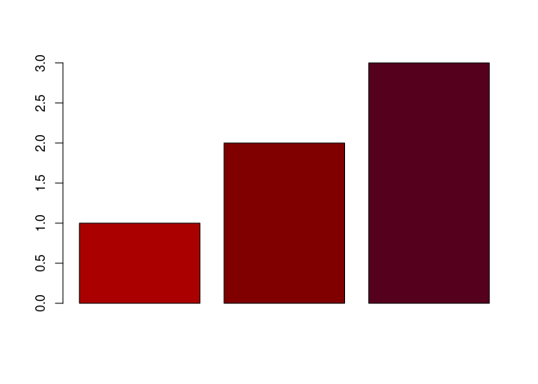

<!-- README.md is generated from README.Rmd. Please edit that file -->

# cns: Color Naming System

<!-- badges: start -->
<!-- badges: end -->

The Color Naming System was an early grammar of color.

In it, colors are created using adjectives and base hues (like
`"dark blue"`), so you won’t ever have to wonder if `"steelblue"` is
darker than `"dodgerblue"`.

## Installation

You can install the released version of cns from
[CRAN](https://CRAN.R-project.org) with:

``` r
install.packages("cns")
```

And the development version from [GitHub](https://github.com/) with:

``` r
# install.packages("remotes")
remotes::install_github("nfultz/cns")
```

## Example

``` r
library(cns)

barplot(1:3, col=cns('light red', 'red', 'dark purplish red'))
```


